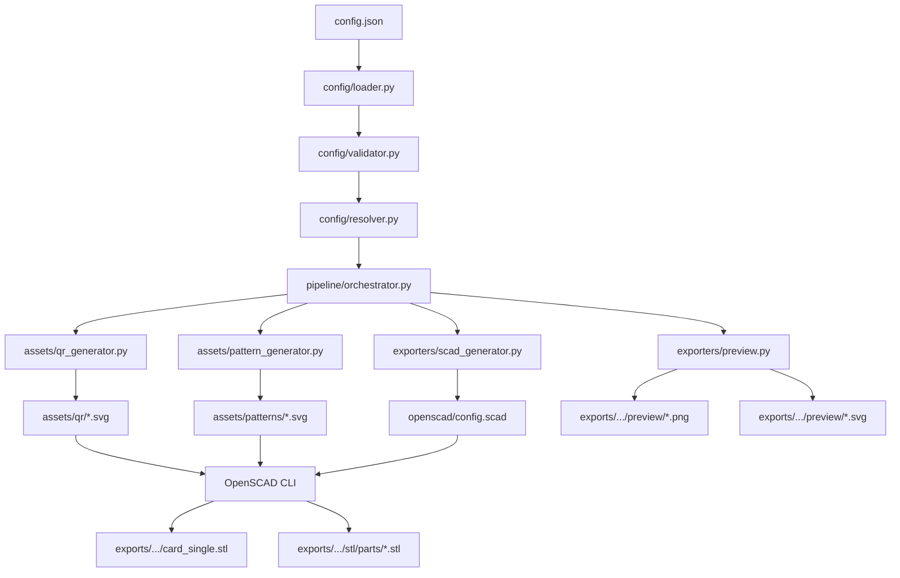

# CardForge — Architecture

> **Version:** 0.1.0  
> **Status:** MVP Design  
> **Repo:** https://github.com/monotributistar/CardForge

## Philosophy

CardForge is a **modular, declarative, extensible** generator for 3D-printable flat objects. It treats every object as a composition of independent features, driven entirely by configuration files — not hardcoded geometry.

**Core principles:**

1. **Configuration is the source of truth.** The JSON config defines *what* to make. STL/3MF files are derived artifacts — never edited directly.
2. **Composition over inheritance.** A business card is not a monolithic class. It is a `FlatObject` containing `Faces`, each composed of `Features` (text, QR, pattern, logo, frame, corners).
3. **Extensible by design.** The core engine works with any flat object type. Business cards are just the first domain.
4. **Printing-aware from day one.** Every design decision respects FDM constraints (0.4mm nozzle, minimum detail, layer height, multi-color strategy).
5. **CLI-first.** No GUI required. One command builds everything: `cardforge build config.json`.

## High-Level Pipeline

```
┌──────────┐    ┌──────────┐    ┌──────────┐    ┌──────────┐    ┌──────────┐
│  CONFIG  │───▶│ COMPOSE  │───▶│ GEOMETRY │───▶│  ASSETS  │───▶│  EXPORT  │
│  (JSON)  │    │ (Python) │    │(OpenSCAD)│    │ (SVG/PNG)│    │ (STL)    │
└──────────┘    └──────────┘    └──────────┘    └──────────┘    └──────────┘
```

### Stage Details

| Stage | Tool | Input | Output |
|-------|------|-------|--------|
| 1. Read | Python (json) | `configs/*.json` | Validated config dict |
| 2. Validate | Python (jsonschema) | Config dict | Validated + normalized config |
| 3. Resolve | Python (string.Template) | Config with `{{var}}` | Resolved config |
| 4. Assets | Python (qrcode, svgwrite) | Resolved config | QR SVG, pattern SVG, previews |
| 5. Geometry | Python → OpenSCAD | Config + asset paths | Generated `.scad` file |
| 6. Render | OpenSCAD CLI | `.scad` file | STL file(s) |
| 7. Export | Python (shutil) | STL files | Organized export directory |
| 8. Preview | Python (Pillow, cairosvg) | STL + config | PNG/SVG previews |

## Component Model

### Hierarchy

```
FlatObject          ← abstract base for any flat 3D object
  └─ Card           ← concrete: business card, badge, tag
       ├─ Face      ← front / back
       │   └─ Layer ← z-ordered group of features
       │       └─ Feature ← text, QR, pattern, logo, frame, corner
       └─ Frame     ← optional border/edge treatment
```

### Feature Interface (Common Contract)

Every feature MUST implement:

| Field | Type | Required | Description |
|-------|------|----------|-------------|
| `id` | string | yes | Unique identifier within the face |
| `type` | string | yes | Feature type: `text-block`, `qr`, `pattern`, `logo`, `frame`, `corner` |
| `face` | string | yes | Target face: `front`, `back` |
| `position` | object | no | `{ x, y }` in mm from top-left of face |
| `size` | object | no | `{ width, height }` in mm (for bounded features) |
| `rotation` | number | no | Rotation in degrees (default: 0) |
| `material` | string | no | Material/color key: `base`, `text`, `accent`, or custom |
| `relief` | object | no | `{ mode, height/depth }` — see Relief System |
| `visibility` | string | no | `visible`, `hidden` (default: `visible`) |
| `zIndex` | number | no | Stacking order within the face (default: auto) |
| `source` | string | no | Reference to a shared asset or data source |

### Concrete Feature Types

#### TextBlock

```json
{
  "type": "text-block",
  "lines": ["Line 1", "{{owner.name}}"],
  "font": "Montserrat",
  "fontSize": 3.2,
  "fontStyle": "bold",
  "align": "left",
  "lineHeight": 1.4
}
```

#### QRCode

```json
{
  "type": "qr",
  "qrType": "vcard",
  "target": "owner",
  "size": 24,
  "errorCorrection": "M",
  "quietZone": 2
}
```

#### Pattern

```json
{
  "type": "pattern",
  "patternType": "text-repeat",
  "text": "JR",
  "spacing": 7,
  "rotation": -25
}
```

#### Logo

```json
{
  "type": "logo",
  "file": "assets/logos/logo.svg",
  "size": { "width": 24 }
}
```

#### Frame

```json
{
  "type": "frame",
  "frameStyle": "border",
  "width": 2,
  "inset": 0
}
```

#### CornerDecoration

```json
{
  "type": "corner",
  "style": "notch",
  "radius": 4
}
```

### Relief System

Controls how a feature interacts with the base surface in Z dimension:

| Mode | Parameter | Direction | Typical Range | Description |
|------|-----------|-----------|---------------|-------------|
| `emboss` | `height` | +Z (raised) | 0.3–0.6 mm | Feature stands proud of surface |
| `deboss` | `depth` | −Z (recessed) | 0.15–0.3 mm | Feature is carved into surface |
| `flush` | — | ±0 | 0 mm | Feature is coplanar (color change only) |
| `cut` | `depth` | −Z (through) | up to face thickness | Feature cuts through the face |

### Material / Color System

Materials map to separate STL files for multi-color printing:

| Material Key | Typical Color | Purpose |
|-------------|---------------|---------|
| `base` | Black/dark | Card body |
| `text` | White/light | Text and QR codes |
| `accent` | Gold/color | Logos, decorations |
| `frame` | Accent or base | Border elements |

User-defined materials can be added via config themes.

## Folder Structure

```
cardforge/
├── README.md                   # Project overview + quick start
├── pyproject.toml              # Python project config (uv)
├── .gitignore
│
├── docs/                       # All documentation
│   ├── ARCHITECTURE.md         # This file
│   ├── COMPONENTS.md           # Component contracts in detail
│   ├── PIPELINE.md             # Pipeline stage documentation
│   ├── ROADMAP.md              # Versioned development plan
│   └── PRINTING_GUIDELINES.md  # FDM printing constraints
│
├── configs/
│   └── examples/               # Example configuration files
│       ├── business_card_basic.json
│       └── business_card_pattern.json
│
├── assets/                     # Static design assets
│   ├── fonts/                  # Font files (.ttf, .otf)
│   ├── logos/                  # Logo SVGs
│   ├── patterns/               # Pattern SVGs
│   ├── qr/                     # Generated QR SVGs (output)
│   └── hueforge/               # Hueforge source images (future)
│
├── src/cardforge/              # Python package
│   ├── __init__.py
│   ├── cli.py                  # CLI entry point (click/argparse)
│   ├── config/
│   │   ├── __init__.py
│   │   ├── loader.py           # JSON config loading
│   │   ├── validator.py        # Schema validation
│   │   └── resolver.py         # Template variable resolution
│   ├── pipeline/
│   │   ├── __init__.py
│   │   ├── orchestrator.py     # Pipeline execution engine
│   │   └── stages.py           # Individual pipeline stages
│   ├── assets/
│   │   ├── __init__.py
│   │   ├── qr_generator.py     # QR code → SVG
│   │   ├── pattern_generator.py # Pattern → SVG
│   │   └── font_manager.py     # Font discovery and metrics
│   ├── exporters/
│   │   ├── __init__.py
│   │   ├── stl_exporter.py     # STL file organization
│   │   ├── scad_generator.py   # Config → OpenSCAD code generation
│   │   └── preview.py          # SVG/PNG preview generation
│   ├── validators/
│   │   └── __init__.py
│   └── preview/
│       └── __init__.py
│
├── openscad/                   # OpenSCAD source files
│   ├── main.scad              # Entry point — includes all modules
│   ├── config.scad            # Generated config parameters
│   └── modules/
│       ├── base.scad           # FlatObject base shape
│       ├── rounded_rect.scad   # Rounded rectangle primitive
│       ├── text_layer.scad     # Text rendering
│       ├── qr_layer.scad       # QR code rendering
│       ├── pattern_layer.scad  # Pattern rendering
│       ├── logo_layer.scad     # Logo rendering
│       ├── frame_layer.scad    # Frame/border rendering
│       ├── corner_layer.scad   # Corner decoration
│       ├── relief.scad         # Relief operations (emboss/deboss)
│       └── color_layers.scad   # Multi-color layer management
│
├── scripts/                    # Standalone utility scripts
│   ├── generate_qr.py
│   ├── generate_pattern.py
│   ├── clean_svg.py
│   └── build.py               # MVP build script (pre-CLI)
│
├── exports/                    # Build outputs (gitignored except .gitkeep)
│   └── .gitkeep
│
└── tests/                      # Test suite
    ├── __init__.py
    ├── test_config/
    ├── test_pipeline/
    └── test_exporters/
```

## Data Flow



## Technology Decisions

### Why Python
- Excellent SVG/JSON handling (qrcode, svgwrite, Pillow)
- Rich CLI ecosystem (click/argparse)
- String template resolution built-in
- Test frameworks mature (pytest)

### Why OpenSCAD (not Blender)
- Declarative — geometry is code, not GUI operations
- CLI-first: `openscad -o output.stl input.scad`
- Parameter passing: `openscad -D var=value`
- Deterministic output for same input
- Lightweight, no GUI required for builds
- Directly targets CSG (Constructive Solid Geometry) which maps naturally to FDM

### Why SVG as Intermediate
- QR codes, logos, patterns are inherently 2D
- OpenSCAD can import SVG via `import()` and extrude
- SVG is text-based, diffable, version-controllable
- Standard format, tool-agnostic

### Why JSON (not YAML)
- Native Python support, no extra dependencies
- Strict syntax — fewer silent errors than YAML
- JSON Schema for validation (mature ecosystem)
- Easy to generate programmatically

### Why STL → 3MF path
- STL is universal for 3D printing slicers
- 3MF supports multi-material, metadata, thumbnails
- v0.1 delivers STL; v0.2 adds 3MF as a superset

## Extension Points

The architecture supports future object types through these extension points:

1. **New FlatObject types:** Add a config template + OpenSCAD module. Core pipeline unchanged.
2. **New Feature types:** Implement the Feature interface, add SCAD module, register in feature registry.
3. **New export formats:** Add exporter module to `src/cardforge/exporters/`.
4. **New relief modes:** Extend `relief.scad` with new operations.
5. **New asset generators:** Add to `src/cardforge/assets/`.

### Future Object Types (Architecture-Ready)

| Type | Dimensions (mm) | Key Differences from Business Card |
|------|-----------------|-----------------------------------|
| `product-label` | 50×30 | Smaller, hole for string/tie |
| `event-badge` | 90×55 | Larger, clip zone, lanyard hole |
| `desk-plate` | 150×40 | Wide, angled stand, large text |
| `qr-sign` | 100×100 | Square, large QR, wall-mount holes |
| `equipment-tag` | 60×30 | Durable, serial number, barcode |
| `keychain-card` | 50×25 | Small, keyring hole |
| `brand-token` | 30×30 | Square, logo-only, collectible |

## Performance Characteristics

- **Config → SCAD:** < 100ms (pure Python)
- **Asset generation (QR):** ~50ms per QR code
- **OpenSCAD render:** 5–60 seconds depending on complexity and preview/resolution settings
- **Preview generation:** ~200ms per face (SVG rasterization)

For the MVP, a full build from config to STL should complete in under 2 minutes on modern hardware.
