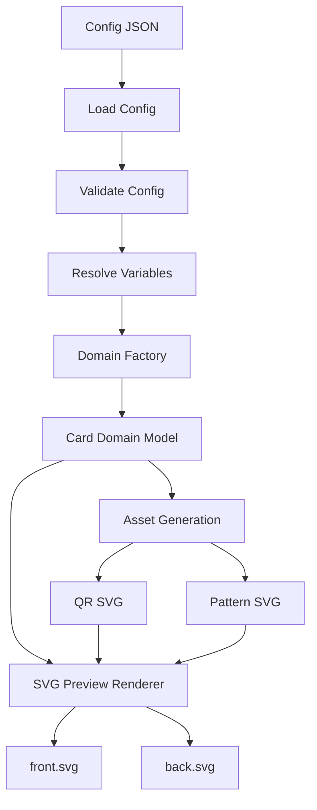

# CardForge — Assets & Preview (Fase 3)

> Version: 0.1.0  
> Depends on: [ARCHITECTURE.md](ARCHITECTURE.md), [DOMAIN_MODEL.md](DOMAIN_MODEL.md)

## Overview

Phase 3 adds derived asset generation and SVG preview rendering to the CardForge pipeline. Given a validated and resolved config, the system now generates:

- **QR codes** as SVG files (vCard, URL, text)
- **Repeating patterns** as SVG files (text-repeat)
- **Face previews** as SVG files showing the complete card layout

No STL or OpenSCAD geometry is generated yet — that comes in Phase 4.

## Pipeline (updated)



## Build Command

```bash
uv run python scripts/build.py configs/examples/business_card_basic.json
```

Output:

```
==================================================
CardForge build
Project: Javier Business Card
Exports: exports/Javier_Business_Card
Generated:
  - assets/qr_vcard_qr.svg
  - assets/pattern_front_bg_monogram.svg
  - preview/front.svg
  - preview/back.svg
==================================================
```

## Export Structure

```
exports/<project_name>/
├── assets/
│   ├── qr_<feature_id>.svg        # QR code SVG
│   └── pattern_<face>_<id>.svg    # Pattern SVG
├── preview/
│   ├── front.svg                  # Front face preview
│   └── back.svg                   # Back face preview
├── scad/                          # Future: OpenSCAD files
├── stl/                           # Future: STL files
│   └── parts/
└── 3mf/                           # Future: 3MF files
```

## QR Generation

**Module:** `src/cardforge/assets/qr.py`

Uses the `qrcode` library to generate SVG QR codes. Each module (black square) is rendered as an SVG `<rect>`, producing clean vector output.

**Supported types:**
- `vcard` — generates vCard from owner data via `build_vcard()`
- `url` — encodes a URL
- `text` — encodes arbitrary text

**Validation:**
- `size_mm > 0`
- `quiet_zone_mm >= 0`
- `error_correction` must be L, M, Q, or H
- `value` must not be empty

**Example output size:** 24mm QR with 2mm quiet zone → 28mm total SVG.

## vCard Builder

**Module:** `src/cardforge/assets/vcard.py`

Builds a vCard 3.0 string from owner config fields:

```
name, title, phone, email, website, github, linkedin
```

Output format:
```
BEGIN:VCARD
VERSION:3.0
FN:Javier Rodriguez
TITLE:Frontend Developer
EMAIL:javier@example.com
...
END:VCARD
```

## Pattern Generation

**Module:** `src/cardforge/assets/patterns.py`

**Implemented:** `text-repeat` — repeats a text string across the face as a tiled grid.

Parameters: `text`, `spacing_mm`, `rotation_deg`, `font_size_mm`, `opacity`, `color`.

The pattern is rendered at face dimensions so it can be used as an SVG `<image>` reference in previews.

## SVG Preview Renderer

**Module:** `src/cardforge/preview/svg_renderer.py`

Renders a face as a visual SVG preview from the domain model. The preview shows:

- Card base with rounded corners and material color
- Patterns as `<image>` references
- QR codes as `<image>` references
- Text blocks as `<text>` elements with correct font/size/color
- Frames as border `<rect>` elements
- Logos as placeholder rectangles

**Preview respects:**
- Feature position, size, and z_index ordering
- Material colors (from theme)
- Visibility (hidden features excluded)
- Font family, size, and style

## Theme System

**Module:** `src/cardforge/preview/theme.py`

The `Theme` class provides color and style configuration for previews:

- Created automatically from card materials via `Theme.from_materials()`
- Maps standard materials (base/text/accent) to theme colors
- Custom materials use their own hex color
- Configurable: font family, stroke width, corner radius

## Asset Manager

**Module:** `src/cardforge/assets/asset_manager.py`

Orchestrates asset generation from the domain model:

1. Iterates all features in the card
2. For `QRCodeFeature`: generates QR SVG with appropriate data
3. For `PatternFeature` (text-repeat): generates pattern SVG
4. Returns `GeneratedAssets` tracking all paths

## Pipeline Stages

**Module:** `src/cardforge/pipeline/stages.py`

Concrete stage implementations for the pipeline orchestrator:

| Stage | Function | Input → Output |
|-------|----------|---------------|
| `load` | `load_config_stage` | config_path → raw_config |
| `validate` | `validate_config_stage` | raw_config → validated_config |
| `resolve` | `resolve_config_stage` | validated_config → resolved_config |
| `domain` | `create_domain_stage` | resolved_config → card, build_context |
| `exports` | `prepare_exports_stage` | project_name → export_paths |
| `assets` | `generate_assets_stage` | card, config → generated_assets |
| `preview` | `render_preview_stage` | card, assets → preview_paths |
| `summary` | `build_summary_stage` | all → printed summary |

## Limitationes actuales

- **No STL generation.** Los previews son puramente 2D SVG.
- **No PNG rasterization.** Solo SVG por ahora (cairosvg no está instalado por defecto).
- **No anchor-based positioning.** Las posiciones se usan directamente del config.
- **No 3MF.** Documentado para v0.2.
- **Patrón text-repeat solamente.** Grid, dots, hex pendientes.
- **Logo solo placeholder.** No se hace import real de SVG de logo.
- **No Hueforge.** Pendiente para futura fase.

## Conexión con OpenSCAD (Fase 4)

En Fase 4, el pipeline se extiende:

```
Preview → SCAD Generator → OpenSCAD CLI → STL Export
```

Los assets SVG generados aquí (QR, patrones) serán referenciados por los módulos OpenSCAD mediante `import()`. El preview SVG servirá como validación visual antes del render 3D.

Los módulos SCAD en `openscad/modules/` importarán los SVG y los extruirán con las operaciones de relieve (emboss/deboss/cut) definidas en el modelo de dominio.
