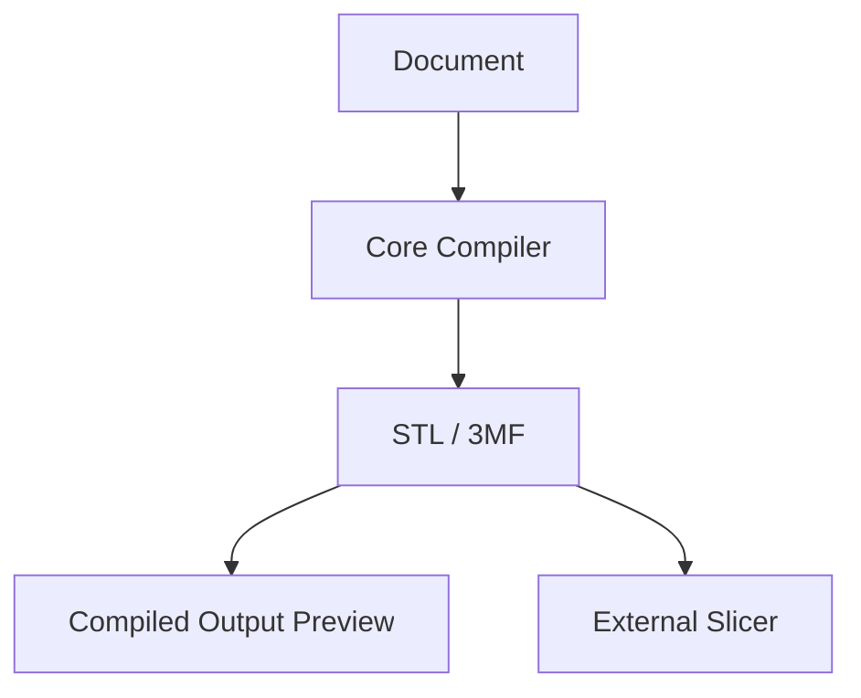

# CardForge — Compiled Output Preview (RFC-011)

## Overview

The Compiled Output Preview is a 3D STL viewer integrated into Studio. It lets you inspect the EXACT files the Core compiler generated — before opening any slicer.



## Three Views, Three Questions

| View | Question | Shows |
|------|----------|-------|
| **Design** | How am I designing? | SVG preview, bounding boxes, drag-to-move |
| **Compiled** | What file am I sending to the slicer? | 3D STL, wireframe, exploded parts |
| **Manufacturing** (future) | How will it be fabricated? | Build plate orientation, layer preview |

## Features

### Orbit / Pan / Zoom
Standard 3D controls. Drag to orbit, scroll to zoom, right-drag to pan. Reset and Fit buttons.

### Render Modes
- **Solid** — Phong-shaded mesh
- **Wireframe** — Triangle edges only
- **Solid + Edges** — Shaded with visible edge outlines

### Material Visibility
Toggle individual STL parts on/off. Legend shows part name and color.

### Exploded View
Slider separates parts vertically (0–100%) for visual inspection of individual layers.

### Load STL
Click "Load STL" in the Compiled tab toolbar. Select one or more `.stl` files. Supports multi-part objects (base, text, accent).

## How to Use

1. Build with Core: `uv run python scripts/build.py doc.cardforge.json --prototype`
2. In Studio, switch to **Compiled** tab
3. Click **Load STL** → select `exports/<doc>/stl/parts/*.stl`
4. Orbit, zoom, toggle parts, explode

## Validations You Can Do

- QR modules visible and complete
- Text features present and positioned correctly
- Relief depth looks right under wireframe
- No missing geometry
- Parts separate cleanly in exploded view
- Colors assigned correctly per material

## Architecture

```
CompiledViewer.tsx
├── Three.js (WebGL renderer)
├── STLLoader (parse binary STL)
├── OrbitControls (camera)
└── UI overlays (tabs, sliders, legend)
```

STL parsing is done client-side via Three.js STLLoader. No server needed.

## Limitations

- **SLA files not supported** — STL only for now
- **No texture support** — solid colors per part
- **No 3MF** — architecture ready, loader not yet implemented
- **No scale reference** — grid is generic, not mm-accurate
- **Single object view** — no multi-document comparison
