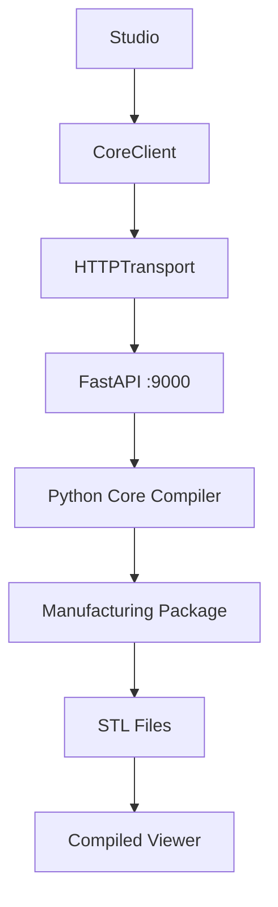

# CardForge — Core API Server (RFC-012)

## Overview

The Core API is a FastAPI HTTP server that wraps the CardForge Core Compiler. It enables Studio to communicate with the Core without CLI — and prepares the architecture for future SaaS.



## Endpoints

| Method | Path | Description |
|--------|------|-------------|
| GET | `/api/health` | Server status |
| POST | `/api/preview` | SVG + manufacturing report |
| POST | `/api/manufacture` | Full build (STL + parts + reports) |
| GET | `/api/jobs/{jobId}` | Job status |
| GET | `/api/files/{jobId}/{path}` | Download generated file |

## Quick Start

```bash
# Terminal 1: API server
pnpm core:api
# or: uv run python scripts/api_server.py

# Terminal 2: Studio
pnpm studio:dev
```

Studio on http://localhost:5173 connects to API on http://localhost:9000.

## CLI vs API

| | CLI | API |
|--|-----|-----|
| Usage | Terminal | HTTP from Studio |
| Output | Files on disk | Files + JSON + HTTP download |
| Speed | Fast (local) | Fast (local) |
| SaaS ready | No | Yes |

Both use the same Core Compiler. The API is another client.

## Studio Integration

1. Click **Manufacture** → select process/profile/faces
2. Studio calls `POST /api/manufacture` with document
3. API generates STL + parts + reports
4. Studio downloads STL files via `/api/files/{jobId}/...`
5. Compiled Viewer auto-loads all parts

If API is not running, Studio shows a clear message with the start command.

## Storage

Builds are stored in `exports/api/<jobId>/`. No database, no cloud storage. Files persist until manually cleaned.

## Future SaaS Considerations

For production SaaS, the following will be needed:

- **Auth** — JWT or API keys
- **Rate limiting** — per-user quotas
- **Job queue** — async workers for long builds
- **File cleanup** — TTL on job directories
- **Sandboxing** — OpenSCAD in isolated process
- **Storage** — S3 or similar for persistent files
- **Timeouts** — per-build time limits

None of this is implemented yet. The API is designed to be compatible.
