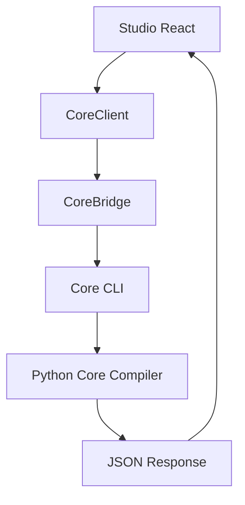

# CardForge — Core Bridge (Single Compiler Architecture)

## Why a Bridge?

During MVP development, Studio had a TypeScript `CompileService` that duplicated parts of the Core compiler — SVG generation and manufacturing analysis. This was a pragmatic shortcut to get live previews working in the browser.

**That duplication ends here.**

## Single Compiler



There is one compiler. It lives in Python. Studio is a client.

## Architecture

### Core CLI (`scripts/core_cli.py`)

```bash
uv run python scripts/core_cli.py preview  doc.cardforge.json   # SVG + manufacturing
uv run python scripts/core_cli.py compile  doc.cardforge.json   # preview + geometry
uv run python scripts/core_cli.py publish  doc.cardforge.json   # full manifest
```

All commands output JSON following the `CoreProtocol` contract.

### CoreProtocol (`studio/core/CoreProtocol.ts`)

TypeScript types that mirror the Python CLI JSON output exactly. No logic — just the contract.

### CoreBridge (`studio/core/CoreBridge.ts`)

Connects Studio to the Core. Currently wraps CLI calls. Designed with a single `executeCoreCli` entry point so the transport can be swapped (HTTP, WebSocket, WASM, IPC) without changing any React component.

### CoreClient (`studio/core/CoreClient.ts`)

The unified API for Studio components:
- `corePreview(document)` — tries Core Bridge, falls back to CompileService
- `corePublish(document)` — tries Core Bridge

When the Bridge is fully available (local dev with Python installed), CompileService becomes dead code and can be removed.

## CoreProtocol Contract

```typescript
interface CorePreviewResponse {
  success: boolean
  preview: { frontSvg: string; backSvg: string }
  manufacturing: {
    score: number; scoreLabel: string; isManufacturable: boolean
    errorCount: number; warningCount: number
    warnings: CoreWarning[]; errors: CoreError[]; suggestions: string[]
  }
}
```

This contract is stable. The Python CLI and TypeScript types must stay in sync.

## Migration Path

1. **Current:** Studio uses CompileService (TS) for live preview
2. **This phase:** CoreClient introduced, falls back to CompileService
3. **Future:** Core Bridge becomes available (local server, WASM, or Electron IPC)
4. **End state:** CompileService removed, single compiler

## CLI Commands

```bash
# Preview (SVG + manufacturing)
uv run python scripts/core_cli.py preview examples/javier.cardforge.json

# Compile (preview + geometry)
uv run python scripts/core_cli.py compile examples/javier.cardforge.json

# Publish (full manifest)
uv run python scripts/core_cli.py publish examples/javier.cardforge.json
```

## What Studio Never Does

- Studio never generates SVG directly
- Studio never runs manufacturing analysis
- Studio never interprets printability rules
- Studio never touches Geometry IR

Studio sends a Document, receives a Response. That's it.
