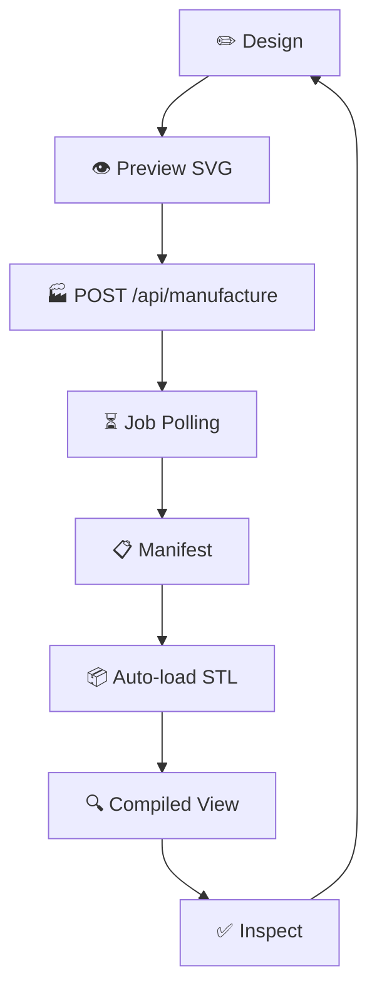

# CardForge — Design → Manufacture → Inspect Loop (RFC-013)

## The Loop



## What the User Experiences

1. **Edit** the document — text, QR, position, theme, relief
2. **See** live SVG preview updating
3. **Click Manufacture** — select process, profile, faces
4. **Watch** progress bar + step indicators in Build Console:
   ```
   ✓ Compiling document
   ✓ Manufacturing analysis  
   ✓ Generating OpenSCAD
   ✓ Generating STL
   ✓ Generating reports
   ● Loading compiled preview...
   ```
5. **Auto-switch** to Compiled View — 3D STL loads automatically
6. **Inspect** — orbit, wireframe, explode, toggle parts
7. **Switch back** to Design — edit, Manufacture again

**No manual file loading. No CLI. No file browser.**

## Architecture

```
App.tsx → ManufacturingSession.runManufactureFlow()
  ├── HTTPTransport.manufacture(document)
  ├── HTTPTransport.jobStatus(jobId)  [poll every 1s]
  ├── HTTPTransport.downloadFile(url) [for each STL part]
  └── Auto-switch to CompiledView
```

## Session State

```typescript
ManufacturingSession {
  jobId: string
  status: 'idle' | 'compiling' | 'manufacturing' | 'loading' | 'done' | 'failed'
  progress: 0-100
  steps: [{ name, status }]
  manifest: {...}
  parts: STLPart[]
  error: string | null
}
```

## Manifest-Driven

The Studio never assumes file names. It reads the manifest returned by the API:

```json
{
  "files": [
    { "name": "stl/card_single.stl", "type": "stl", "url": "/api/files/abc123/stl/card_single.stl" },
    { "name": "stl/parts/01_base_pla.stl", "type": "stl_part", ... },
    ...
  ]
}
```

The manifest is the single source of truth for what was generated.

## Error Handling

If manufacture fails:
- Progress shows failed step in red
- Build Console shows error message
- Document remains editable
- User can retry

## Quick Start

```bash
# Terminal 1: API
pnpm core:api

# Terminal 2: Studio  
pnpm studio:dev
```

Open http://localhost:5173 — design, manufacture, inspect — all in one flow.
