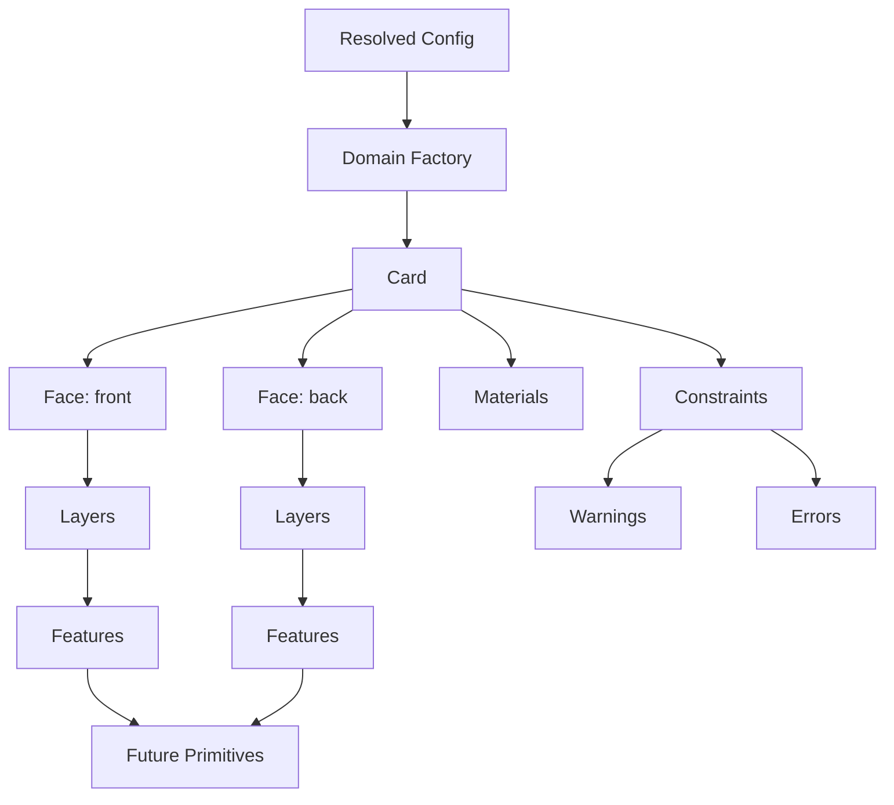

# CardForge — Domain Model

> Version: 0.1.0  
> Depends on: [ARCHITECTURE.md](ARCHITECTURE.md), [COMPONENTS.md](COMPONENTS.md)

## Overview

The Domain Model is the internal representation of a CardForge object. It sits between the resolved configuration (JSON → dict) and the geometry generation (OpenSCAD). Every concept in the config has a corresponding domain class.

## Model Hierarchy



## Core Concepts

### FlatObject → Card

The root domain object. Currently implemented as `Card` — the only concrete type. Future objects (badge, label, tag) will share the same interface:

| Property | Type | Description |
|----------|------|-------------|
| `id` | str | Unique identifier (snake_case project name) |
| `name` | str | Human-readable name |
| `width` | float | Object width in mm |
| `height` | float | Object height in mm |
| `thickness` | float | Object thickness in mm |
| `corner_radius` | float | Corner rounding radius in mm |
| `object_type` | str | Type discriminator (business-card, event-badge, etc.) |
| `materials` | dict[str, Material] | Material map |
| `faces` | dict[str, Face] | Face map (front, back) |

### Face

One side of the object. A business card has `front` and `back`. A desk plate might have only one face.

| Property | Type | Description |
|----------|------|-------------|
| `id` | str | Face identifier (front, back) |
| `width` | float | Face width (matches object) |
| `height` | float | Face height (matches object) |
| `layers` | list[Layer] | Ordered layers |

### Layer

A z-ordered group of features within a face. Provides semantic grouping.

| Property | Type | Description |
|----------|------|-------------|
| `id` | str | Layer identifier |
| `role` | str | Semantic role (base, content, accent, etc.) |
| `z_index` | int | Sorting order (lower = behind) |
| `features` | list[Feature] | Features in this layer |

**Standard layer roles:**

| Role | Z-Index | Purpose |
|------|---------|---------|
| `base` | 0 | Background, base material |
| `background` | 1 | Decorative background elements |
| `decorative` | 2 | Patterns, watermarks |
| `content` | 3 | Text, QR, logos — the main content |
| `functional` | 4 | Alignment marks, cut guides |
| `accent` | 5 | Highlights, frames |
| `debug` | 99 | Debug overlays |

### Feature

The building blocks users place on faces. Each feature type has a specific subclass.

**Common interface (all features):**

| Field | Type | Description |
|-------|------|-------------|
| `id` | str | Unique identifier |
| `type` | str | Feature type discriminator |
| `position` | Position | Position in mm from face top-left |
| `size` | Size | Bounding box in mm |
| `material` | Material | Material for multi-color export |
| `relief` | Relief | Z-axis treatment |
| `visible` | bool | Visibility flag |
| `z_index` | int | Layer stacking order |

**Concrete feature types:**

| Class | type value | Extra fields |
|-------|-----------|--------------|
| `TextBlockFeature` | `text-block` | lines, font, font_size, font_style, align, line_height |
| `QRCodeFeature` | `qr` | qr_type, target, error_correction, quiet_zone |
| `PatternFeature` | `pattern` | pattern_type, text, spacing, rotation |
| `LogoFeature` | `logo` | svg_file |
| `FrameFeature` | `frame` | frame_style, frame_width, inset |
| `CornerDecorationFeature` | `corner` | corner_style, radius |

### Feature vs Primitive

```
Feature                    Primitive
───────                    ─────────
Semantic/functional        Geometric/renderable
"What" the user wants      "How" it's drawn
e.g. QRCodeFeature         → SVGPrimitive (QR matrix as SVG)
e.g. TextBlockFeature      → TextPrimitive (text lines)
e.g. LogoFeature           → SVGPrimitive (logo SVG)
e.g. PatternFeature        → GroupPrimitive (repeated elements)
```

In Phase 2, Primitives are modeled but do not generate geometry yet. The Feature → Primitive expansion happens in a future phase (Phase 3 or 4) when we build the OpenSCAD generator.

### Position, Size, Bounds

**Coordinate system:** 2D cartesian, origin at top-left of face. All values in mm.

```
(0,0) ────────────── +X
  │
  │   Face
  │
  +Y
```

| Class | Fields | Purpose |
|-------|--------|---------|
| `Position` | x, y | Point in mm |
| `Size` | width, height | Dimensions in mm |
| `Bounds` | x, y, width, height | Axis-aligned bounding box |

**Bounds provides:**
- `right`, `bottom` — computed edges
- `center` — center point
- `contains(other)` — full containment check
- `intersects(other)` — overlap check
- `expand(margin)` — grow by margin on all sides

### Anchor System

Anchors define reference points for positioning:

```
top-left      top-center      top-right
center-left   center          center-right
bottom-left   bottom-center   bottom-right
```

Anchors are defined in the `Anchor` enum but position computation from anchors is deferred to a future layout phase.

### Material System

Materials represent manufacturing intent, not just visual color.

| Field | Type | Description |
|-------|------|-------------|
| `id` | str | Unique key (base, text, accent) |
| `name` | str | Human name (Black PLA) |
| `color` | str | Hex color for previews |
| `role` | str | Manufacturing role |

**Default materials:**

| id | Name | Color | Role |
|----|------|-------|------|
| `base` | Black PLA | `#1a1a1a` | base |
| `text` | White PLA | `#ffffff` | text |
| `accent` | Gold PLA | `#ffd700` | accent |

Materials with different IDs produce separate STL files for multi-color printing.

### Relief System

| Mode | Parameter | Direction | Use |
|------|-----------|-----------|-----|
| `emboss` | `height` (mm) | +Z raised | Text, QR, logos |
| `deboss` | `depth` (mm) | −Z recessed | Patterns, watermarks |
| `flush` | — | ±0 | Color-only features |
| `cut` | `depth` (mm) | −Z through | Holes, cutouts |

**Validation rules enforced by `Relief.__post_init__`:**
- `emboss` requires `height > 0`, must not have `depth`
- `deboss` requires `depth > 0`, must not have `height`
- `cut` requires `depth > 0`, must not have `height`
- `flush` accepts no parameters (or ignores them)

### Constraints

Domain-level validation beyond JSON Schema. Constraints produce `ERROR` (blocking) or `WARNING` (advisory) issues.

| Constraint | Severity | Checks |
|-----------|----------|--------|
| `min_feature_size` | ERROR | Feature ≥ 0.6mm in both dimensions |
| `inside_face_bounds` | ERROR | Feature fully contained in face |
| `no_overlap` | WARNING | Two features don't intersect |
| `qr_min_size` | WARNING | QR ≥ 22mm |
| `qr_quiet_zone` | WARNING | QR has 2mm margin on all sides |
| `safe_margin` | WARNING | Feature has ≥ 1mm from face edges |

### BuildContext

Holds all context during a build:

| Field | Type | Description |
|-------|------|-------------|
| `manufacturing` | ManufacturingSettings | Process, nozzle, layer height |
| `materials` | dict[str, Material] | Available materials |
| `resolved_config` | dict | Original resolved config |
| `constraint_result` | ConstraintResult | Accumulated issues |

### Factory

`create_card_from_config(config, context)` converts a resolved config dict into a populated Card domain object.

**Mapping:**
```
config.object.width        → card.width
config.object.height       → card.height
config.object.thickness    → card.thickness
config.object.cornerRadius → card.corner_radius
config.theme               → materials (color mapping)
config.faces.front.features → card.faces["front"].layers[0].features
config.faces.back.features  → card.faces["back"].layers[0].features
```

**Feature dispatch:**
- `"text-block"` → `TextBlockFeature`
- `"qr"` → `QRCodeFeature` (with source resolution)
- `"pattern"` → `PatternFeature`
- `"logo"` → `LogoFeature`
- `"frame"` → `FrameFeature`
- `"corner"` → `CornerDecorationFeature`
- unknown → `FactoryError`

## Coordinate System

```
    0         width
  0 ┌──────────────┐
    │              │
    │    Face      │
    │              │
    │  (x,y)──┐    │
    │  │Feature│   │
    │  └───────┘   │
    │              │
height└──────────────┘
```

- Origin (0,0) = top-left corner of face
- +X = right
- +Y = down
- Z = out of the face plane (positive = emboss, negative = deboss/cut)

## What is NOT implemented yet

- Geometry generation (OpenSCAD code)
- Primitive → SCAD expansion
- Asset generation (QR SVG, pattern SVG)
- STL export
- 3MF export
- Preview rendering
- Automatic layout / anchor-based positioning
- Constraint execution during build (constraints are defined but not automatically applied yet)

## Connection to Future Phases

```
Phase 2 (current)    → Phase 3+4          → Phase 5+
Domain Model          Asset Gen + SCAD      Export + CLI

Card                  → generates config.scad
Face                  → face module calls
Layer                 → z-ordering via translate
Feature               → expands to Primitives
  TextBlockFeature    → TextPrimitive → text_layer.scad
  QRCodeFeature       → SVGPrimitive  → qr_layer.scad (SVG import)
  PatternFeature      → GroupPrimitive → pattern_layer.scad
  LogoFeature         → SVGPrimitive  → logo_layer.scad
  FrameFeature        → RectanglePrimitive → frame_layer.scad
  CornerFeature       → corner_layer.scad
Material              → separate STL per material
Relief                → emboss/deboss/cut operations in relief.scad
```

## Package Structure

```
src/cardforge/domain/
├── __init__.py
├── geometry.py       # Position, Size, Bounds, Anchor enum
├── material.py       # Material, DEFAULT_MATERIALS
├── relief.py         # Relief, ReliefMode enum
├── transform.py      # Transform (position + rotation + scale)
├── constraints.py    # Constraint functions, ConstraintIssue, ConstraintResult
├── primitive.py      # Primitive base + Rectangle, Text, SVG, Group
├── feature.py        # Feature base + TextBlock, QR, Pattern, Logo, Frame, Corner
├── layer.py          # Layer (z-ordered feature group)
├── face.py           # Face (one side of object)
├── card.py           # Card (the root domain object)
├── build_context.py  # BuildContext + ManufacturingSettings
└── factory.py        # create_card_from_config()
```
