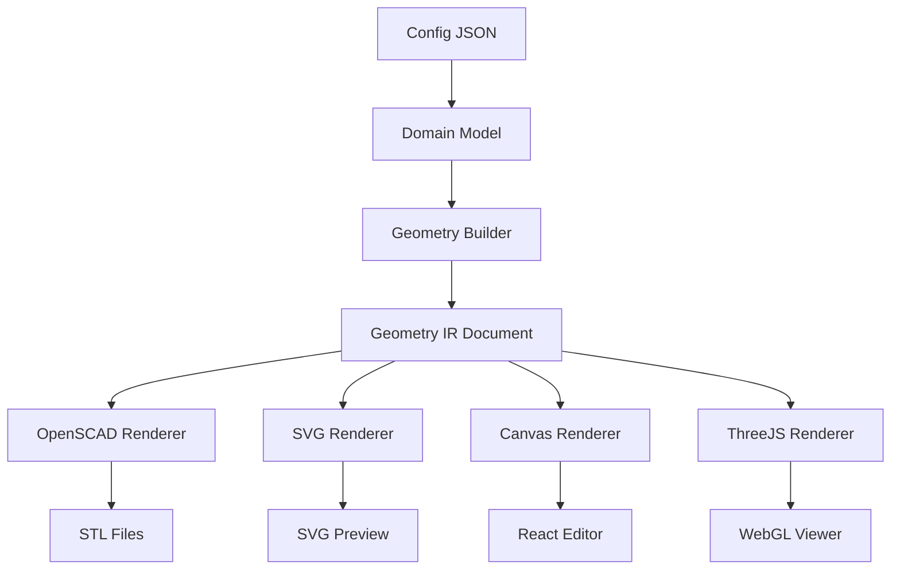

# CardForge — Geometry Intermediate Representation (IR)

> Version: 0.1.0  
> Fase: 5.5 — Arquitectura

## Why Geometry IR?

Before Phase 5.5, the pipeline was:

```
Card → OpenSCAD Generator → STL
```

OpenSCAD was the "internal language" of the project. Every renderer would need to understand Card domain objects directly.

With Geometry IR:

```
Card → GeometryBuilder → GeometryDocument → Renderer → Output
                                             ├── OpenSCADRenderer → STL
                                             ├── SVGRenderer → Preview
                                             ├── CanvasRenderer → Editor
                                             └── ThreeJSRenderer → WebGL
```

CardForge is now a **compiler of manufacturable flat objects**. The Domain Model defines *what* to build. Geometry IR defines *how* it's shaped. Renderers convert that shape into specific output formats.

## Architecture



## Package Structure

```
src/cardforge/geometry_ir/
├── nodes.py               # Geometry nodes (Document, shapes, transforms)
├── visitor.py             # Abstract GeometryVisitor
├── renderer_protocol.py   # GeometryRenderer protocol
├── builder.py             # Card → GeometryDocument
└── openscad_visitor.py    # Document → OpenSCAD code
```

## Node Types

### Containers

| Node | Purpose |
|------|---------|
| `DocumentNode` | Root of the geometry tree |
| `GroupNode` | Logical grouping (no CSG) |
| `UnionNode` | CSG union of children |
| `DifferenceNode` | CSG difference (first child minus rest) |

### 2D Shapes

| Node | Purpose |
|------|---------|
| `RectangleNode` | Axis-aligned rectangle |
| `RoundedRectangleNode` | Rectangle with rounded corners |
| `SVGNode` | SVG file reference |
| `TextNode` | Text element |

### 3D / Transforms

| Node | Purpose |
|------|---------|
| `ExtrudeNode` | Linear extrusion (2D → 3D) |
| `TranslateNode` | Translation |
| `MirrorNode` | Mirror along axis |

## Visitor Pattern

Every renderer is a `GeometryVisitor`. The visitor pattern allows adding new renderers without modifying the node classes:

```python
class MyRenderer(GeometryVisitor):
    def visit_RectangleNode(self, node):
        # render rectangle in my format
    def visit_TextNode(self, node):
        # render text in my format
    # ...
```

Current visitors:
- `OpenSCADVisitor` — renders to .scad code
- Future: SVG, Canvas, ThreeJS, STEP, DXF

## Geometry Builder

Converts a `Card` domain object into a `DocumentNode` tree:

```python
builder = GeometryBuilder()
document = builder.build(card, generated_assets)
```

The builder maps:
- Card dimensions → RoundedRectangleNode + ExtrudeNode
- TextBlockFeature → TextNode + ExtrudeNode + TranslateNode
- QRCodeFeature → SVGNode + ExtrudeNode + TranslateNode
- PatternFeature → SVGNode (deboss or emboss)
- Back face → MirrorNode wrapper
- Feature position → translate coordinates (converted to OpenSCAD center-origin)

## Renderer Protocol

```python
class GeometryRenderer(Protocol):
    def render(self, document: DocumentNode) -> str:
        ...
```

Any renderer accepting a `DocumentNode` and returning a string satisfies this protocol.

## Difference from Domain Model

| Concept | Domain Model | Geometry IR |
|---------|-------------|-------------|
| Purpose | What to build | How to shape it |
| Level | Semantic | Geometric |
| Examples | Card, Face, Feature, Material | Extrude, Translate, Union, SVG |
| Coupling | Config-aware | Renderer-agnostic |
| Consumers | Validators, BuildContext | OpenSCAD, SVG, Canvas, ThreeJS |

## Future Renderers

### SVG Renderer
Would produce 2D technical drawings from the same IR tree, independent of OpenSCAD.

### Canvas Renderer
For a React-based visual editor. Users would manipulate Geometry IR nodes directly.

### ThreeJS Renderer
WebGL 3D preview without needing OpenSCAD installed.

### STEP/DXF Renderers
CAD interchange formats for professional manufacturing pipelines.

## What Did NOT Change

- External behavior: builds produce identical STL output
- Existing tests all pass
- Config format unchanged
- CLI unchanged
- Preview generation unchanged
- Domain Model unchanged

## Constraints Still in Domain

Constraints, validation, and manufacturing rules remain in the Domain layer. The Geometry IR is purely geometric — it carries metadata for debugging and future editor features, but doesn't enforce printability rules.
