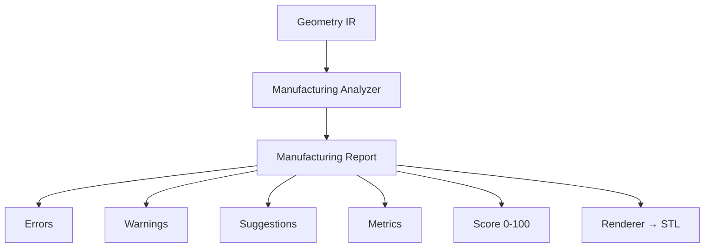

# CardForge — Manufacturing Analysis Engine (Fase 6)

> Version: 0.1.0  
> Depends on: [GEOMETRY_IR.md](GEOMETRY_IR.md)

## Overview

The Manufacturing Analysis Engine answers a single question:

> Is this object manufacturable under a given process?

It analyzes Geometry IR against a manufacturing profile and produces a report with errors, warnings, suggestions, metrics, and a manufacturability score.

CardForge is no longer just a geometry compiler — it's a **manufacturing-oriented compiler**.

## Architecture



## Pipeline

```
Config → Domain Model → Geometry IR → Manufacturing Analyzer → Report → Renderer → STL
```

The analyzer runs BEFORE rendering. Manufacturing issues are detected before OpenSCAD generates geometry.

## Package Structure

```
src/cardforge/manufacturing/
├── profiles.py       # ManufacturingProfile (FDM, SLA, future processes)
├── issues.py         # ManufacturingIssue, IssueCode, Severity
├── rules.py          # Rule functions (check_line_width, check_qr_size, etc.)
├── metrics.py        # ManufacturingMetrics
├── report.py         # ManufacturingReport, ManufacturingFix
├── analyzer.py       # ManufacturingAnalyzer (GeometryVisitor)
└── units.py          # Physical units and constants
```

## Manufacturing Profiles

A profile defines the capabilities and constraints of a manufacturing process:

```python
profile = ManufacturingProfile.fdm_standard()
# nozzle=0.4, min_line_width=0.4, min_emboss=0.3, min_qr_size=22, ...

profile = ManufacturingProfile.fdm_fine()
# nozzle=0.25, tighter tolerances

profile = ManufacturingProfile.sla_standard()
# resin printer, much tighter tolerances
```

Built-in profiles:
- `fdm_standard()` — 0.4mm nozzle, PLA
- `fdm_fine()` — 0.25mm nozzle
- `sla_standard()` — resin printer

Custom profiles can define any constraints for future processes (CNC, laser, waterjet, etc.).

## Rules

Each rule checks one aspect of the geometry against the profile:

| Rule | Checks | Severity |
|------|--------|----------|
| `check_line_width` | Shape dimensions ≥ min_line_width | ERROR |
| `check_wall_thickness` | Wall width ≥ min_wall | WARNING |
| `check_emboss_height` | Extrude height ≥ min_emboss | WARNING |
| `check_deboss_depth` | Deboss depth ≥ min_deboss | WARNING |
| `check_qr_size` | QR size ≥ min_qr_size | ERROR |
| `check_qr_module_size` | QR module ≥ min_qr_module | WARNING |
| `check_text_size` | Font size ≥ min_text_size | WARNING |
| `check_gap` | Gap between features ≥ min_gap | WARNING |
| `check_unsupported_relief` | Relief mode in supported list | WARNING |

## Manufacturing Report

The report aggregates all analysis results:

```python
report = analyzer.analyze(document)

report.score           # 0-100 manufacturability score
report.is_manufacturable  # True if no errors/fatals
report.score_label     # Human-readable rating
report.errors          # List of ERROR issues
report.warnings        # List of WARNING issues
report.suggestions     # List of fix suggestions
report.metrics         # Computed measurements
```

## Scoring

| Score | Label |
|-------|-------|
| 95-100 | Excellent — ready to print |
| 80-94 | Good — printable with minor warnings |
| 60-79 | Fair — review warnings before printing |
| 30-59 | Poor — significant issues |
| 0-29 | Not manufacturable — fix errors first |

Scoring formula:
- Start at 100
- FATAL: -40 each
- ERROR: -15 each
- WARNING: -5 each
- INFO: -1 each

## Manufacturing Analyzer

Implemented as a `GeometryVisitor` that walks the IR tree:

```python
profile = ManufacturingProfile.fdm_standard()
analyzer = ManufacturingAnalyzer(profile)
report = analyzer.analyze(geometry_document)
```

At each node, the analyzer:
1. Updates metrics (counts, min/max values)
2. Applies relevant rules
3. Records issues in the report

## Metrics

Computed from the geometry tree:

- `feature_count`, `svg_count`, `text_count`, `extrude_count`
- `smallest_line`, `largest_line` (mm)
- `smallest_emboss`, `largest_emboss` (mm)
- `smallest_deboss`, `largest_deboss` (mm)
- `smallest_text` (mm)
- `smallest_qr` (mm)
- `min_wall` (mm)
- `estimated_materials`, `estimated_colors`

## Future: Auto Fix

The `ManufacturingFix` class defines the interface for automatic fixes:

```python
fix = ManufacturingFix(
    node_id="qr1",
    description="Increase QR to 24mm",
    action="increase_size",
    suggested_value=24.0,
)
```

Not implemented yet — designed for a future phase where the system can automatically adjust geometry to meet manufacturing constraints.

## Integration

The analyzer is designed to be called from:
- CLI: `cardforge analyze config.json --profile fdm-standard`
- Pipeline: as a stage before rendering
- React Studio: to show issues in the editor
- Exporters: to validate before exporting

## What This Is NOT

- **Not a geometry modifier.** The analyzer reads Geometry IR but never changes it.
- **Not a slicer.** It doesn't generate toolpaths or g-code.
- **Not domain validation.** Config validation happens earlier in the pipeline. This analyzes geometry, not configuration.

## Future Processes

The profile system is designed for extensibility:

- **SLA** — resin printing (tighter tolerances, different relief behavior)
- **Laser** — cutting/engraving (2D operations, no emboss)
- **CNC** — milling (material removal, tool diameter constraints)
- **Vinyl** — cutting (2D vector, weeding constraints)
- **PCB Milling** — circuit boards (trace width, isolation)

Each new process just needs a `ManufacturingProfile` with its constraints. The rules and analyzer work without modification.
