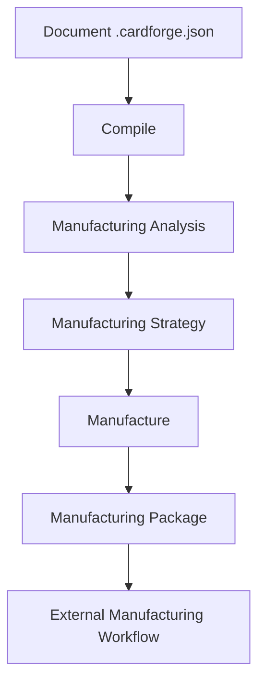

# CardForge — Manufacturing Pipeline (RFC-010)

## Philosophy

> CardForge does not generate STL. CardForge prepares objects for manufacturing.

The document describes the object. The manufacturing section describes how to produce it. The Studio unites both through a coherent fabrication flow, decoupled from any specific slicer or hardware.

## Flow



## Key Concepts

### Presentation Face
The face shown to the end user. Not necessarily the print face.
```
presentationFace: front   →  "The front is what people see"
```

### Preferred Print Face
Face placed on the build plate for FDM. Affects first-layer quality.
```
preferredPrintFace: back  →  "Print with back face down"
```

### Manufacturing Strategy
Per-process decisions:
- **FDM:** first layer relief (deboss), elephant foot compensation, ironing
- **SLA:** orientation optimization
- **Laser:** no orientation, depth control
- **CNC:** max depth, tool path strategy

## Why CardForge Doesn't Depend on a Slicer

The slicer is user choice. CardForge delivers a **Manufacturing Package** — a self-contained directory with STL, previews, reports, and a manifest. The user imports this into their preferred slicer (Bambu Studio, Orca, Prusa, Cura).

## Manufacturing Package

```
exports/<document-id>/
├── document/resolved.cardforge.json
├── preview/front.svg · back.svg
├── reports/manufacturing_report.json
├── scad/generated.scad
├── stl/card_single.stl
├── stl/parts/01_base_pla.stl, 02_text_pla.stl, 03_accent_pla.stl
├── print/README_PRINT.md
└── manifest.json       ← includes process, profile, faces, strategy
```

## Studio UX

The user does NOT click "Export STL". The user clicks **Manufacture** and selects:

1. **Process** — FDM / SLA / Laser / CNC
2. **Profile** — Standard 0.4mm / Fine 0.25mm / Draft 0.6mm
3. **Presentation Face** — front / back
4. **Preferred Print Face** — front / back
5. **Outputs** — Preview / SCAD / STL / Material STL / Report

CardForge decides what to generate based on the selected process.

## Future: Auto-Optimization

- `preferredPrintFace` can be auto-detected (minimize support, maximize detail)
- Orientation can be optimized per process
- Strategy rules can suggest print settings
