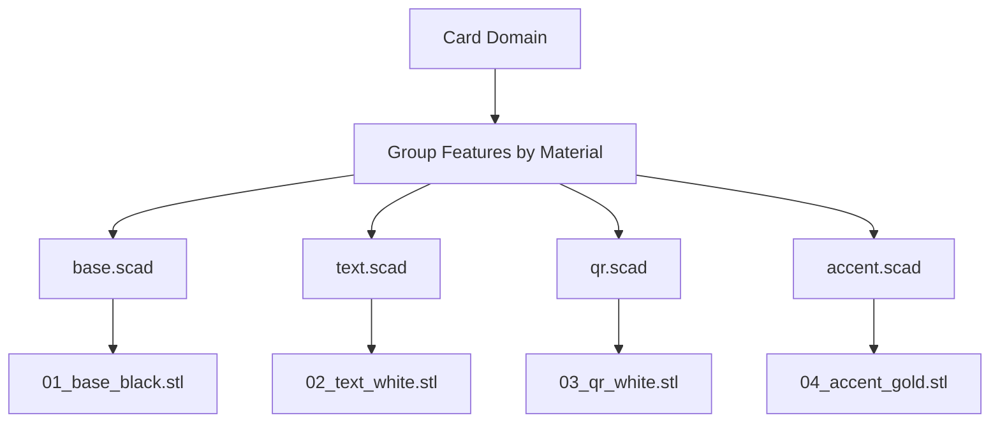

# CardForge — Multi-Color STL Export (Fase 5)

> Version: 0.1.0  
> Depends on: [OPENSCAD_AND_STL.md](OPENSCAD_AND_STL.md)

## Overview

Phase 5 adds material-separated STL export for multi-color 3D printing. Instead of a single monolithic STL, the system now generates one STL file per material — base, text, QR, accent — all sharing the same coordinate system so they align perfectly when imported together into a slicer.

## Why Separate STLs?

STL files don't carry color information. To print in multiple colors, you need separate geometry files that the slicer assigns to different filaments. CardForge groups features by their material and exports each group as an independent STL.

## Output Structure

```
exports/<project>/
  stl/
    card_single.stl          ← Single STL (unchanged)
    parts/
      01_base_black.stl       ← Card body + deboss patterns
      02_text_white.stl       ← Text + QR codes  
      03_accent_gold.stl      ← Logo + decorative elements
```

## Build Command

```bash
uv run python scripts/build.py configs/examples/business_card_basic.json --stl --parts
```

Output:

```
==================================================
CardForge build
Project: Javier Business Card
Exports: exports/Javier_Business_Card
Generated:
  - scad/generated.scad
  - stl/card_single.stl (4 KB)
  - stl/parts/01_accent_pla.stl (1 KB)
  - stl/parts/02_base_pla.stl (4 KB)
  - stl/parts/03_text_pla.stl (478 KB)
==================================================
```

## Pipeline



## How It Works

### 1. Material Grouping

`group_features_by_material(card)` collects all visible features and groups them by `material.id`. The `base` group always exists (for the card body). Features within each group are sorted by `z_index` for correct rendering order.

### 2. Per-Material SCAD Generation

`generate_material_scad_files()` creates a `.scad` file for each material:

- **base**: contains `card_base()` + deboss patterns
- **text**: contains `text_emboss_layer()` calls for all TextBlockFeatures + SVG imports for QRs
- **accent**: contains logo placeholders and decorative elements

All SCAD files share the same coordinate system: centered origin, with features positioned at their correct locations. The include path uses absolute paths for reliability.

### 3. OpenSCAD Rendering

`run_openscad_many()` executes OpenSCAD sequentially for each material SCAD. Results are checked individually — if one material fails, others still proceed.

### 4. File Naming

Deterministic naming: `{index:02d}_{material_id}_{color_name}.stl`

## Importing in Slicers

### Bambu Studio / OrcaSlicer

1. Import all parts STLs together
2. Select "Yes" when asked if files are a single object with multiple parts
3. Assign each part to a different filament in the Objects panel
4. Parts will be perfectly aligned since they share the same coordinate origin

### PrusaSlicer

1. Import as multi-part object
2. Right-click → Split to parts
3. Assign extruders per part

## Important: Overlapping Embossed Parts

Current approach uses overlapping embossed geometry:

- `base.stl` contains the full card body
- `text.stl` contains text extruded on top of the base
- `qr.stl` contains QR extruded on top of the base

The slicer treats these as a multi-part assembly. The Z overlap is intentional and harmless — the slicer merges coincident faces.

Future phase may implement boolean-subtracted sockets for perfect encastre.

## Limitations

- **No 3MF packaging yet.** Each STL is a separate file; 3MF would bundle them with material metadata.
- **No automatic color assignment in STL.** The user manually assigns filaments in the slicer.
- **Logo is placeholder cube.** Real SVG logo import pending.
- **Frame and corner features not implemented** in material SCADs.
- **Pattern deboss only works on base material.** Other material deboss patterns are skipped.

## What Comes Next (Fase 6: 3MF)

3MF format supports:
- Multiple objects in one file
- Per-object material/color metadata
- Embedded thumbnails
- Print settings

This will simplify the multi-color workflow from "import N files and assign filaments" to "open one file, everything pre-configured."
