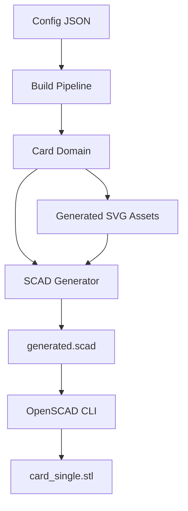

# CardForge — OpenSCAD Geometry & STL Export (Fase 4)

> Version: 0.1.0  
> Depends on: [ARCHITECTURE.md](ARCHITECTURE.md), [DOMAIN_MODEL.md](DOMAIN_MODEL.md), [ASSETS_AND_PREVIEW.md](ASSETS_AND_PREVIEW.md)

## Overview

Phase 4 connects the CardForge domain model and generated assets to OpenSCAD, producing the first printable STL file. The system now generates OpenSCAD code from the domain model, executes the OpenSCAD CLI, and exports a single binary STL.

## Pipeline (updated)



## Build Command

```bash
# Without STL (previews only):
uv run python scripts/build.py configs/examples/business_card_basic.json

# With STL:
uv run python scripts/build.py configs/examples/business_card_basic.json --stl
```

Output with `--stl`:

```
==================================================
CardForge build
Project: Javier Business Card
Exports: exports/Javier_Business_Card
Generated:
  - assets/qr_vcard_qr.svg
  - assets/pattern_front_bg_monogram.svg
  - preview/front.svg
  - preview/back.svg
  - scad/generated.scad
  - stl/card_single.stl (1 KB)
==================================================
```

## OpenSCAD Module Structure

```
openscad/
├── main.scad                        # Entry point — includes all modules
└── modules/
    ├── rounded_rect.scad            # 2D rounded rectangle primitive
    ├── card_base.scad               # 3D card base (rectangle + extrude)
    ├── svg_layer.scad               # SVG import + extrude for QR/patterns
    ├── text_layer.scad              # OpenSCAD text() + extrude
    └── relief.scad                  # emboss, deboss, cut operations
```

### Module Details

**rounded_rect.scad** — Creates a 2D rounded rectangle centered at origin using `offset()` for smooth corners.

**card_base.scad** — Extrudes the rounded rectangle to create the solid card body. Centered at origin, extends from z=0 to z=thickness.

**svg_layer.scad** — Imports an SVG file, scales it, and extrudes it as a 3D layer. Used for QR codes and patterns.

**text_layer.scad** — Renders text using OpenSCAD's built-in `text()` function with configurable font, size, alignment, and extrusion height.

**relief.scad** — Centralized relief operations:
- `emboss(height)`: union (feature on top of base)
- `deboss(depth, thickness)`: difference (subtract shallow layer)
- `cut(depth, thickness)`: difference (full subtraction)

## Coordinate System

Python uses top-left origin; OpenSCAD uses centered origin. The generator converts:

```
scad_x = python_x - width/2
scad_y = height/2 - python_y
```

Example: feature at Python (0, 0) on an 85×54 card becomes SCAD (-42.5, 27).

### Face Handling

- **Front face:** Features rendered at z = thickness (above the card)
- **Back face:** Features rendered with `mirror([0, 0, 1])` below the card

## Relief Implementation Status

| Mode | Status | Implementation |
|------|--------|---------------|
| `emboss` | ✅ Working | `svg_emboss_layer` / `text_emboss_layer` above base |
| `deboss` | ✅ Working (patterns) | `difference()` with shallow extrusion |
| `flush` | ⚠️ Skipped | No Z displacement |
| `cut` | 🔲 Pending | Architecture ready in `relief.scad` |

## What Gets Rendered

| Feature | Status | Method |
|---------|--------|--------|
| Card base | ✅ | `card_base(width, height, thickness, radius)` |
| QRCode | ✅ | SVG import → `svg_emboss_layer` |
| Pattern (text-repeat) | ✅ | SVG import → `svg_emboss_layer` or `deboss` |
| TextBlock | ✅ | `text_emboss_layer` with OpenSCAD `text()` |
| Logo | ⚠️ Placeholder | `cube()` block |
| Frame | 🔲 TODO | Comment only |
| Corner | 🔲 TODO | Handled by `rounded_rect` radius |

## OpenSCAD CLI Integration

**Module:** `src/cardforge/export/openscad_cli.py`

Discovers OpenSCAD via:
1. `OPENSCAD_BIN` environment variable
2. `shutil.which("openscad")` (PATH)
3. macOS app bundle paths

Command: `openscad -o output.stl --export-format binstl input.scad`

## Python SCAD Generator

**Module:** `src/cardforge/scad/generator.py`

Converts a `Card` domain object to a `generated.scad` file:

1. Writes header with project info
2. Includes `main.scad` (all modules)
3. Renders `card_base` with card dimensions
4. Iterates front face features (sorted by zIndex)
5. Iterates back face features (mirrored)
6. For each visible feature, generates appropriate module call
7. Writes file to `exports/<project>/scad/generated.scad`

## Limitations

- **Single STL only.** No color/material separation yet.
- **No logo SVG import.** Logo renders as placeholder cube.
- **No frame geometry.** Frame features are comments only.
- **No corner decorations.** Handled implicitly by card base radius.
- **Text via OpenSCAD text().** Font availability depends on system. SVG text not imported.
- **Pattern deboss is basic.** Subtracts a shallow layer from the base.
- **Back face `mirror()` may need tuning** for correct orientation.

## Installing OpenSCAD

```bash
# macOS
brew install --cask openscad

# After install, configure:
export OPENSCAD_BIN=/Applications/OpenSCAD.app/Contents/MacOS/OpenSCAD
# or:
xattr -d com.apple.quarantine /Applications/OpenSCAD-2021.01.app  # if needed
```

## Connection to Fase 5

Phase 5 will add:
- Color-separated STL export (one STL per material)
- 3MF export with multi-material metadata
- Better logo handling
- Frame geometry implementation
- PNG preview rasterization
- More pattern types (grid, dots, hex)
