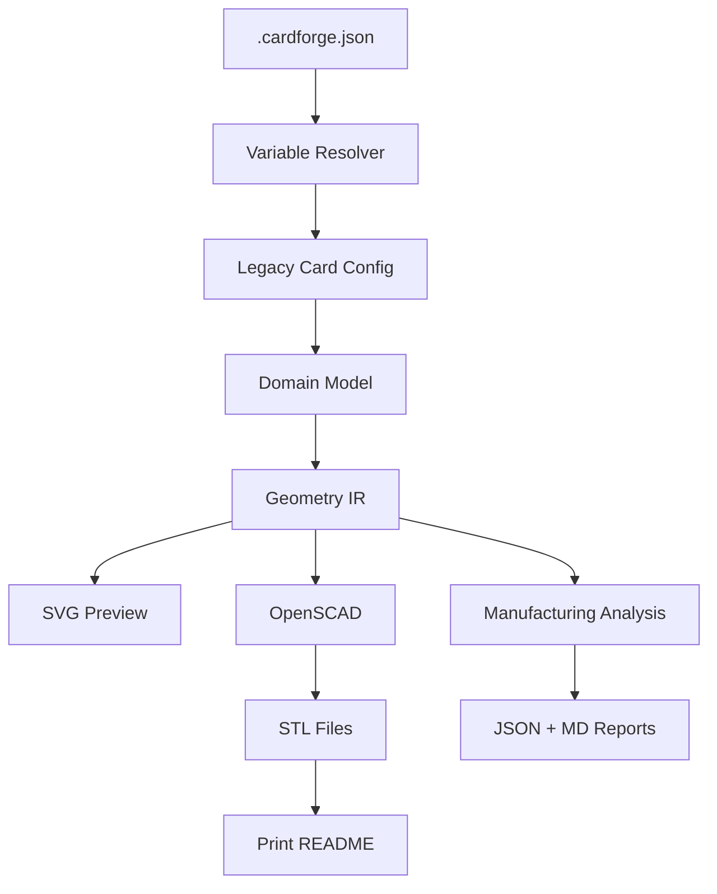

# CardForge — Prototype Loop (Workstream Phase)

> Version: 0.1.0

## Overview

The Prototype Loop enables rapid iteration on CardForge documents. You edit a `.cardforge.json` file, run one command, and get everything: previews, manufacturing report, single STL, color-separated STLs, and a print-ready README.

## Quick Start

```bash
# Create a document
cp examples/javier.cardforge.json my-card.cardforge.json

# Edit variables, features, etc.

# Full prototype build
uv run python scripts/build.py my-card.cardforge.json --prototype

# Watch mode — rebuild on save
uv run python scripts/build.py my-card.cardforge.json --prototype --watch
```

## Document Format



## Document Structure

```json
{
  "document": { "id": "...", "name": "...", "version": "..." },
  "manufacturing": { "profile": "fdm-standard", ... },
  "variables": { "name": "...", "email": "..." },
  "assets": { "logo": "assets/logos/logo.svg" },
  "objects": [ { "type": "business-card", "faces": {...} } ],
  "exports": { "singleStl": true, "colorSeparatedStl": true }
}
```

## Variable System

Use `{{variable}}` in feature fields:

```json
{ "lines": ["{{name}}", "{{title}}", "{{email}}"] }
```

Asset references: `{{assets.logo}}`

## CLI Flags

| Flag | Effect |
|------|--------|
| `--prototype` | Full build: previews + reports + single STL + color STLs + print README |
| `--clean` | Delete previous exports before building |
| `--watch` | Watch file for changes, rebuild automatically |
| `--open-preview` | Open front.svg after build |
| `--profile <name>` | Manufacturing profile (fdm-standard, fdm-fine, sla) |
| `--stl` | Single STL only |
| `--parts` | Color-separated STLs only |
| `--report-only` | Report only, no STL |
| `--ignore-manufacturing-errors` | Export even with errors |

## Export Structure

```
exports/<document_id>/
├── document/
│   └── resolved.cardforge.json
├── preview/
│   ├── front.svg
│   └── back.svg
├── reports/
│   ├── manufacturing_report.json
│   └── manufacturing_report.md
├── assets/
├── scad/
│   ├── generated.scad
│   └── parts/
├── stl/
│   ├── card_single.stl
│   └── parts/
│       ├── 01_base_pla.stl
│       ├── 02_text_pla.stl
│       └── ...
└── print/
    └── README_PRINT.md
```

## Backwards Compatibility

Legacy config files (`business_card_basic.json`) continue to work:

```bash
uv run python scripts/build.py configs/examples/business_card_basic.json --stl --parts
```

The system auto-detects document vs legacy format.

## Print README

Auto-generated with:
- Manufacturing profile and score
- Warnings and suggestions
- STL file inventory
- Multi-color printing instructions (Bambu Studio, OrcaSlicer, PrusaSlicer)
- Recommended print settings

## Limitations

- Single object per document (future: multi-object)
- QR type always "url" in documents (vCard, WiFi pending)
- Watch mode uses simple mtime polling (1s interval)
- No hot-reload for previews in watch mode
