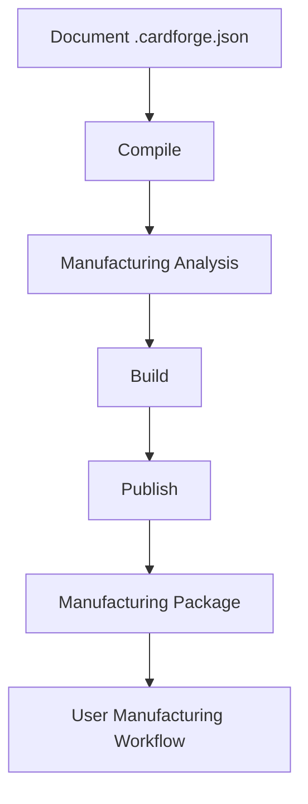

# CardForge — Publish Pipeline (MVP-002)

## Overview

CardForge is not a slicer. It doesn't depend on OrcaSlicer, Cura, or PrusaSlicer. CardForge ends when it delivers a **Manufacturing Package** — a self-contained directory with everything needed to fabricate the object. The user chooses their own manufacturing workflow.

## The Pipeline



### Compile
Generates preview (SVG) and manufacturing analysis. Runs live in Studio (TypeScript CompileService) or via Core for full fidelity.

### Build
Generates geometry files: OpenSCAD → STL (single + color-separated). Requires Core CLI.

### Publish
Organizes everything into a consistent package structure with a manifest.

## Manufacturing Package Structure

```
publish/<document-id>/
├── document/
│   └── resolved.cardforge.json
├── preview/
│   ├── front.svg
│   └── back.svg
├── reports/
│   ├── manufacturing_report.json
│   └── manufacturing_report.md
├── scad/
│   └── generated.scad
├── stl/
│   ├── card_single.stl
│   └── parts/
│       ├── 01_base_pla.stl
│       ├── 02_text_pla.stl
│       └── 03_accent_pla.stl
├── print/
│   └── README_PRINT.md
└── manifest.json
```

## Manifest

```json
{
  "document": "Javier Business Card",
  "version": "0.1",
  "timestamp": "2026-07-01T...",
  "profile": "fdm-standard",
  "process": "fdm",
  "nozzle": 0.4,
  "layerHeight": 0.2,
  "material": "PLA",
  "score": 95,
  "scoreLabel": "Excellent — ready to print",
  "manufacturable": true,
  "files": [...],
  "materials": ["PLA"],
  "colorCount": 1
}
```

## Studio Integration

1. Design the card (edit text, variables, QR)
2. Live preview + manufacturing score updates
3. Click **Publish** → dialog shows summary
4. Confirm → manifest downloaded, package ready

## Why CardForge Doesn't Depend on a Slicer

- Slicers are user choice (Bambu Studio, Orca, Prusa, Cura)
- Slicer profiles are printer-specific and change over time
- CardForge's job is geometry + manufacturing validation
- The package format is universal (STL, SVG, JSON)

## Print Profiles (Future)

Generic profiles define manufacturing constraints:

- `fdm-standard` — 0.4mm nozzle, PLA, 0.2mm layers
- `fdm-fine` — 0.25mm nozzle, higher detail
- `sla-standard` — resin, tight tolerances
- `laser-prototype` — cutting/engraving

Users will eventually create custom profiles for their specific printers.

## What's NOT in scope

- Direct printer connection
- Slicer integration
- Print queue
- Remote printing
- 3MF packaging
- ZIP archives
