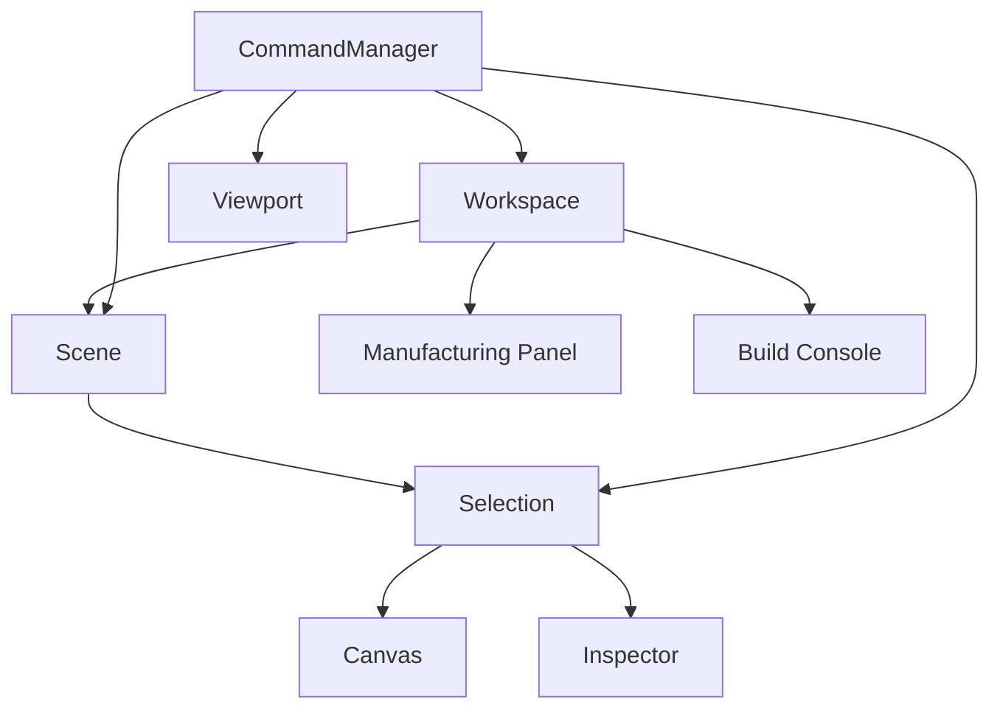

# CardForge Studio — Architecture (RFC-001)

> Foundation of the CardForge Manufacturing IDE

## Philosophy

```
Studio ≠ Core
```

The Core Compiler exists and is stable. The Studio is its primary client — a visual IDE for designing manufacturable objects. They communicate through files (Bridge v0) and will communicate through an API (Bridge v1+).

The Studio is designed as a **Manufacturing IDE**, not a card editor. Its architecture supports future undo/redo, macros, AI actions, and collaboration.

## Architecture



## Module Tree

```
apps/studio/src/studio/
├── types/              # Shared types (FeatureId, FaceId, WorkspacePreferences)
├── workspace/          # Workspace — open project, document, preferences
│   └── Workspace.ts
├── scene/              # Scene — what is being visualized
│   └── Scene.ts
├── selection/          # Selection — selection model
│   └── Selection.ts
├── viewport/           # Viewport — zoom, offset, fit
│   └── Viewport.ts
├── commands/           # Command system — all user actions flow here
│   └── CommandManager.ts
├── canvas/             # Canvas — renders Scene via Viewport
│   └── Canvas.tsx
├── inspector/          # Inspector — shows properties of selected feature
│   └── Inspector.tsx
├── manufacturing/      # Manufacturing Panel — score, warnings, suggestions
│   └── ManufacturingPanel.tsx
├── build/              # Build Console — logs, output (placeholder)
│   └── BuildConsole.tsx
├── hooks/              # React hooks
│   └── index.ts
└── services/           # Services (DocumentService, BuildService, PreviewService)
    └── index.ts
```

## Module Responsibilities

### Workspace
- Holds the open document, manufacturing report, preferences
- Prepared for multi-document in the future
- **Consumes:** nothing (root)
- **Consumed by:** App, Commands, Manufacturing Panel

### Scene
- Tracks active face, hidden features, hover state
- Does NOT modify Geometry IR
- **Consumes:** nothing
- **Consumed by:** Canvas, Commands

### Selection
- Selection model: select, clear, isSelected
- All feature selection flows through this module
- **Consumes:** nothing
- **Consumed by:** Inspector, Canvas, Commands

### Viewport
- Zoom level, offset, grid/bounds visibility
- **Consumes:** nothing
- **Consumed by:** Canvas, Commands

### CommandManager
- Central dispatcher for all user actions
- Every action is a Command
- Enables future undo/redo, macros, shortcuts, AI
- **Consumes:** Workspace, Scene, Selection, Viewport
- **Consumed by:** App (user interactions)

### Canvas
- Renders the Scene through the Viewport
- **Consumes:** Scene (what), Viewport (how), Workspace (SVG data)
- **Does NOT consume:** Document directly, Selection

### Inspector
- Shows properties of the selected feature or document
- **Consumes:** Selection (selectedFeatureId), Workspace (document data)
- **Does NOT consume:** Canvas, Scene

### Manufacturing Panel
- Shows manufacturing score, warnings, suggestions
- **Consumes:** ManufacturingReport (from Workspace)
- **Does NOT consume:** Document, Canvas, Selection

### Build Console
- Placeholder for build output
- **Consumes:** BuildService (future)

## Why a Command System?

Every user action goes through `CommandManager.execute(command)`. This single architectural decision enables:

- **Undo/Redo** — replay history backwards
- **Macros** — batch multiple commands
- **Keyboard shortcuts** — map keys to command IDs
- **AI actions** — AI generates command sequences
- **Collaboration** — sync command streams between users
- **History** — persistent action log

Without changing any UI component. Just the CommandManager.

Currently undo/redo throw "Not implemented". The infrastructure is ready.

## Dependency Rules

1. **No circular dependencies** — the dependency graph is a DAG
2. **Modules import types, not each other's state**
3. **Canvas never imports Inspector, and vice versa**
4. **Everything passes through Commands or Selection**

## What's NOT implemented yet

- Feature editing (position, size, text)
- Drag & drop
- Snapping, guides
- Undo/Redo (infrastructure exists, actions throw)
- Keyboard shortcuts
- History persistence
- Backend API
- Hot-reload

## Next: RFC-002

- Editing commands
- Property modification
- Undo/Redo implementation
- Keyboard shortcuts
- Local API bridge
