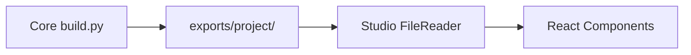

# CardForge — Studio Bridge v0

> Connects Core exports to Studio visualization

## Overview

Studio Bridge v0 enables Studio to consume files generated by the Core compiler. No API, no WebSocket, no backend — just browser FileReader API loading exports from disk.

## Workflow



## How to Use

### 1. Build with Core

```bash
uv run python scripts/build.py examples/prototypes/card_minimal.cardforge.json --prototype
```

This generates:
```
exports/card-minimal/
├── document/resolved.cardforge.json
├── preview/front.svg
├── preview/back.svg
└── reports/manufacturing_report.json
```

### 2. Open Studio

```bash
pnpm studio:dev
```

### 3. Load Files

Click "Load Files" in the top bar and select all four files. Studio will:
- Parse the JSON document → feature tree in LeftPanel
- Parse the manufacturing report → score in BottomPanel
- Display SVGs → Canvas with front/back toggle
- Show properties → RightPanel on feature click

## Supported Formats

| File | Detected by | Loaded as |
|------|------------|-----------|
| `*.cardforge.json` | Extension | Document |
| `resolved.*.json` | Filename contains "resolved" | Document |
| `manufacturing_report.json` | Filename contains "manufacturing" or "report" | Report |
| `front.svg` | `.svg` extension + "front" in name | Front preview |
| `back.svg` | `.svg` extension + "back" in name | Back preview |
| Legacy `business_card_basic.json` | Has `project` key | Document (converted) |

## Error Handling

- Invalid JSON → error message in BottomPanel
- Missing files → component shows placeholder
- Unknown format → error added to state
- SVG parse failure → Canvas shows empty state

## Limitations

- **No hot-reload** — must re-import files after each build
- **No .cardforge.json editing** — read-only visualization
- **SVG unsanitized** — uses `dangerouslySetInnerHTML`
- **Single document** — no multi-project support
- **No dark/light toggle**

## Next: Bridge v1

- Local API server (Python FastAPI or similar)
- `POST /build` to trigger Core builds from Studio
- `GET /projects` to list existing exports
- Auto-reload on build complete
- Feature editing (position, text, size)
- Save edited .cardforge.json back to disk
