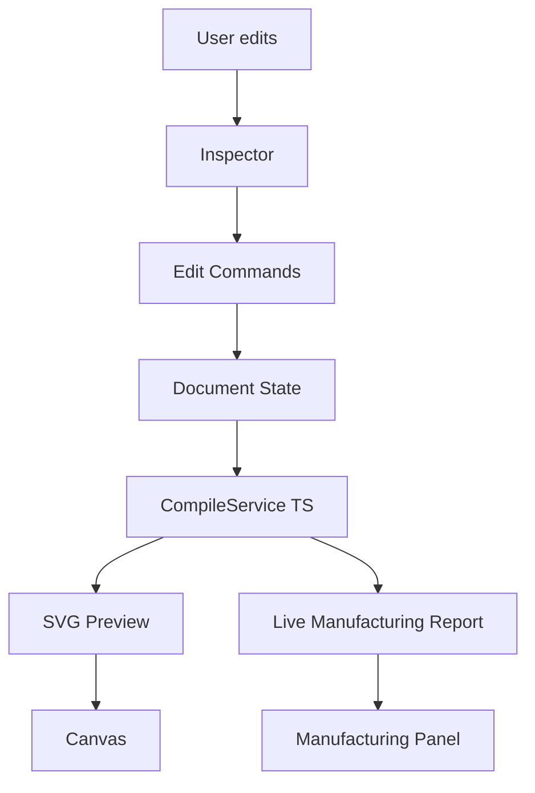

# CardForge Studio — MVP-001: Design Your First Card

> First usable version of CardForge Studio

## Overview

MVP-001 makes Studio a working product: you can create a business card, edit text and QR, see live previews and manufacturing scores, and save your document — all without touching JSON.



## What You Can Do

1. **New Card** — creates a business card template with name, title, email, website, QR
2. **Edit Text** — change lines, font size, material, emboss height
3. **Edit QR** — change QR value (URL) and size
4. **Edit Variables** — change name, title, email, website, phone
5. **Live Preview** — SVG updates instantly on every edit
6. **Live Manufacturing Score** — score and warnings update instantly
7. **Save** — downloads `.cardforge.json` file
8. **Open** — re-opens a saved or existing document

## Architecture

### Document as Source of Truth

```
User Edit → Command → Document State → CompileService → UI Update
```

All edits mutate the Document. The CompileService reads the Document and generates SVG + manufacturing report. Canvas and Manufacturing Panel are read-only consumers.

### CompileService (TypeScript)

A lightweight TypeScript reimplementation of the Core pipeline for live Studio use:

- **SVG Generation** — renders faces directly to SVG strings with text, QR placeholders, patterns
- **Manufacturing Analysis** — checks text size, QR size, emboss height against FDM profile

This is NOT a replacement for the Core compiler — just enables instant preview without a Python backend.

### Edit Commands

| Command | What it does |
|---------|-------------|
| `UpdateTextCommand` | Changes feature lines |
| `UpdateFontSizeCommand` | Changes font size |
| `UpdateReliefCommand` | Changes emboss height |
| `UpdateMaterialCommand` | Changes material (text/base/accent) |
| `UpdateQRValueCommand` | Changes QR URL |
| `UpdateQRSizeCommand` | Changes QR size |
| `UpdateVariableCommand` | Changes document variable |

All executed through `CommandManager.execute()` — ready for undo/redo.

## Flow

```
1. Click "New Card" → template appears
2. Select "front-name" in tree → Inspector shows text fields
3. Edit text → preview updates instantly
4. Edit variables → {{name}} resolves everywhere
5. Score updates live (95 → 90 if font too small)
6. Click "Save" → downloads edited.cardforge.json
```

## Limitations

- **No visual editing on Canvas** — edit through Inspector only
- **No QR rendering** — QR shown as placeholder rect
- **No pattern editing** — patterns not implemented in CompileService
- **No Build from Studio** — STL generation requires CLI
- **No undo/redo** — commands are tracked but not reversible yet
- **Live SVG is approximate** — not pixel-identical to Core output

## Next: MVP-002

- Build button wired to Core (local API)
- QR SVG rendering in live preview
- Canvas-based editing (drag, resize)
- Undo/redo
- Pattern editing
