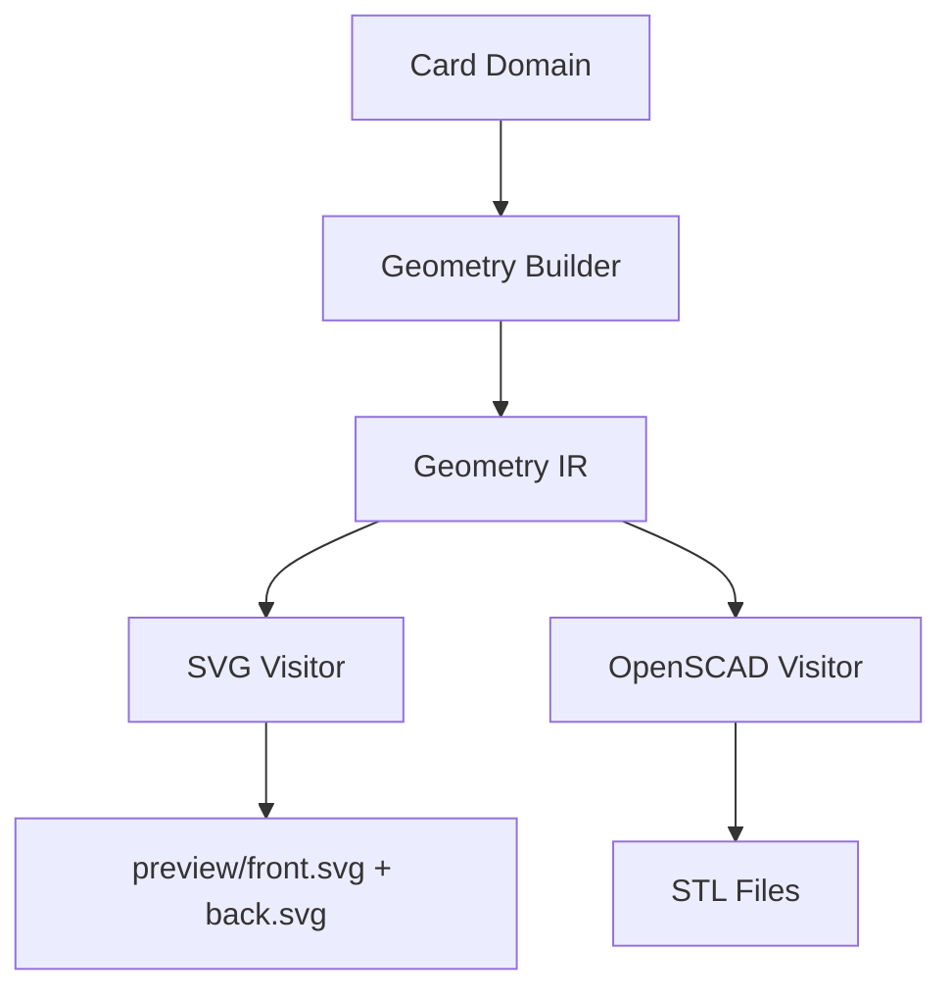

# CardForge — SVG Visitor + Unified Preview (Fase 8)

> Version: 0.1.0

## Overview

Phase 8 replaces the old Card-based preview renderer with a **Geometry IR → SVG Visitor**. The preview system is now a proper renderer backend, just like OpenSCAD.

## Architecture



## Before vs After

| Aspect | Before (Phase 3) | After (Phase 8) |
|--------|-----------------|-----------------|
| Input | Card domain object | GeometryDocument |
| Renderer | svg_renderer.py (custom) | SVGVisitor (visitor pattern) |
| Architecture | Direct domain → SVG | Domain → IR → Visitor → SVG |
| Extensibility | One-off renderer | Part of multi-backend system |
| Consistency | Separate logic from SCAD | Same IR tree, different visitor |

## SVGVisitor

Renders Geometry IR nodes to 2D SVG:

- `RoundedRectangleNode` → `<rect rx>`
- `TextNode` → `<text>` with font/color/alignment
- `SVGNode` → `<image href="...">` for QR and patterns
- `TranslateNode` → `<g transform="translate(...)">`
- `RotateNode` → `<g transform="rotate(...)">`
- `MirrorNode` → `<g transform="scale(...)">`
- `ExtrudeNode` → renders children 2D (height ignored)
- `DifferenceNode` → reduced opacity group

### Face Filtering

The visitor accepts an optional `face_id` parameter. When set, only leaf nodes (shapes, text, SVG) with matching `metadata.face` are rendered. Containers pass through.

```python
visitor = SVGVisitor(face_id="front")
svg_code = visitor.render(document)
```

## Material Colors

Colors are determined from `metadata.material`:

| Material | Color |
|----------|-------|
| base | #1a1a1a |
| text | #ffffff |
| accent | #ffd700 |
| qr | #ffffff |

## Pipeline

The updated pipeline order:

```
load → validate → resolve → domain → exports → assets
  → geometry_ir → preview → manufacturing → [scad → stl] → summary
```

Geometry IR is built before preview (since preview now consumes IR) and before manufacturing analysis.

## Limitations

- **2D only.** ExtrudeNode height ignored, no 3D perspective.
- **DifferenceNode approximate.** Shows children with opacity=0.6.
- **No font embedding.** Uses system fonts via CSS.
- **No interactive editing.** Static SVG output only.

## Future

This architecture enables:
- **Canvas Renderer** for a React-based editor — same IR tree, different visitor
- **Live preview** as config changes
- **Selection and snapping** on the IR tree
- **Excalidraw-style** direct manipulation
